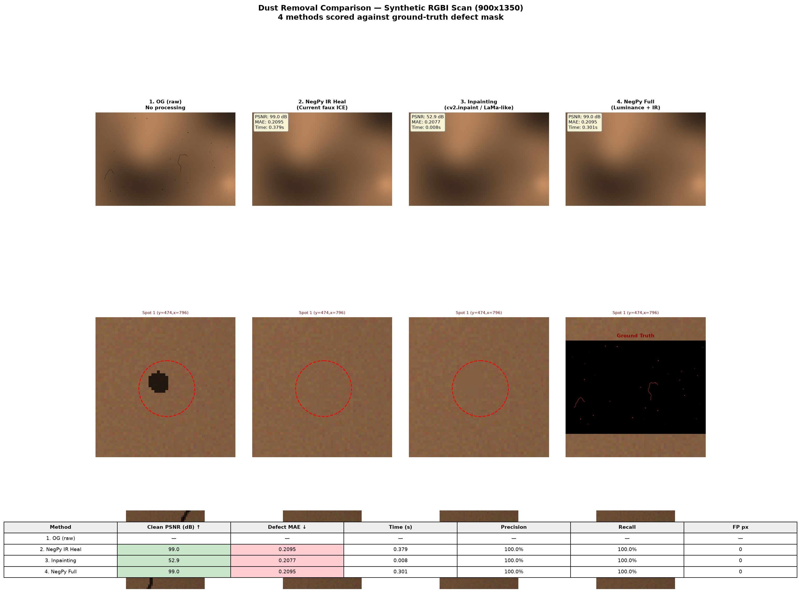

# Digital Fauxice

By Rohan Pandula

[](https://github.com/rohanpandula/digital-fauxice/actions/workflows/tests.yml)

Digital Fauxice is a free, open-source recreation of Digital ICE, the infrared
dust and scratch removal built into the Nikon Super Coolscan 5000 ED. It was
written from scratch, runs no Nikon code, and produces the same output Nikon's
processing does, compared value by value across two complete 4000 dpi frames:
68,447,316 16-bit values per frame, zero mismatches.

This repository contains the portable processing core, synthetic tests, and
sanitized validation receipts. It does not contain Nikon software, firmware,
scanner binaries, personal scans, or the separate color-inversion work.

## Why it still matters

Digital ICE was built by Applied Science Fiction in the late 1990s, licensed
into a generation of film scanners, and then orphaned. Kodak bought the
company in 2003. Nikon, which had put the best-regarded version of it in the
Coolscan line, ended that line around 2010. The scanners that carried it are
out of production, and a working Super Coolscan 5000 or 9000 now resells for
more than it cost new. A good part of that price is the dust removal.

Nothing since has replaced it. Infrared cleaning needs a fourth channel the
scanner reads in hardware, and software that knows what to do with it. The
hardware went out of production and the software stayed locked to it. Camera
scanning, which is how most people digitize film today, captures no infrared
at all, so it has no equivalent. The choice there is spotting dust by hand or
letting a general inpainting tool guess at the whole frame. VueScan and
SilverFast still ship their own infrared cleaning and both are worth running,
but people who compare them against a Coolscan tend to come back to Nikon's
processing, and that processing only runs inside a dead driver on hardware
Nikon stopped supporting years ago.

This project takes it off the machine. The exact recreation reproduces
Nikon's result value for value, on any computer, with no Nikon code involved.
The optional hybrid mode then does something the original never could. On the
worst damage, where Nikon's method leaves a visible scar, it routes just those
regions to a modern inpainting model and composites the fill back in,
disclosed and bounded, while every pixel outside stays exactly what Nikon
would have produced.

## What Digital ICE does

A compatible film scanner records four channels: red, green, blue, and
infrared. The dyes in ordinary color negative film transmit much of the
infrared light. Dust and scratches do not, so the infrared channel gives the
software a second view of surface damage that is largely independent of the
photograph.

The hard part is deciding what is really a defect, then repairing it without
flattening grain or copying an edge into the wrong place. Nikon's
implementation does much more than threshold the infrared plane and call an
inpainting tool. The specific machinery it uses is listed under technical
details below.

Digital Fauxice recreates that processing without loading Nikon code at
runtime. The Nikon result appears only in the validation campaign, as a
read-only answer key.

## Did it work

Yes. Two different physical frames went through the full native 4000 dpi path
and matched Nikon's output exactly: every one of the 68,447,316 values per
frame, zero mismatches. The second frame ran on frozen code and a frozen
profile with no retuning, so the match is not the product of tuning until one
image happens to agree.

The pure Python and NumPy reference takes roughly an hour per frame. It is
deliberately a conservative research implementation. The optional CUDA backend
produces byte-identical output in about 5.5 to 6.5 seconds on an NVIDIA RTX
A4000 (the sequential writer chain runs on one host CPU core through the same
compiled path as the CPU backend below), an optional compiled CPU backend
does the same in about ten seconds on an Apple M4, an optional Metal backend
does the same in about nine seconds on that M4's GPU, and all of them fail
closed rather than run in any configuration they cannot verify.

## Optional AI repair for the worst damage

Some regions are damaged badly enough that the engine's internal defect score
bottoms out at its floor, the strongest damage signal it can express. The
exact repair still runs there, but severe defects like deep gouges and wide
blobs can leave visible residue.

For exactly those regions I built fauxce-hybrid, an optional companion tool
that routes the saturated areas to an AI inpainting model (LaMa) and
composites the result into the exact output. AI fill-in is invention, not
recovery, so the tool is built around rules that keep it honest:

- The router only escalates a saturated region to the model once it covers at
  least 400 pixels or has an in-frame chessboard radius of at least 5 pixels,
  then dilates the routed union by 4 pixels.
- Outside the AI patches, the output stays byte-identical to the exact
  result, and the run's receipt proves that pixel by pixel.
- Every AI-filled pixel is disclosed in a mask written next to the output.
  Nothing is blended in silently.
- If the patches would cover more than 2% of the frame, the tool refuses to
  run.
- Grain inside a patch is generated by the model. It looks like film grain,
  but it is not your film's grain, and the tool never claims it is.
- This core package keeps zero machine-learning dependencies. The hybrid tool
  lives in a separate package with its own pinned model runtime.

On my two validation frames the tool routed 0.07% of frame 1 and 1.36% of
frame 2 to the model. I reviewed both results at up to 3x magnification, in
normal and inverted polarity, and accepted them on 2026-07-17. This repository
ships the diagnostics export the hybrid tool binds to.

fauxce-hybrid now lives in [`hybrid/`](hybrid/) in this repository. Grab the
engine wheel and the `fauxce-hybrid` wheel from the same
[release](https://github.com/rohanpandula/digital-fauxice/releases) and
`pip install` both, engine first. For development, clone the repository and
run `uv sync --extra test` inside `hybrid/`; its `pyproject.toml` points at
the engine in this same repo as an editable path dependency.

The tool never bundles the inpainting runtime or the model weights. You
supply a pinned [IOPaint 1.6.0](https://pypi.org/project/IOPaint/) runtime in
its own environment, plus `big-lama.pt` from the upstream
[Sanster release](https://github.com/Sanster/models/releases/tag/add_big_lama),
whose SHA-256 the tool measures and records rather than trusting a filename:
`344c77bbcb158f17dd143070d1e789f38a66c04202311ae3a258ef66667a9ea9`. Neither is
redistributed here.

Hybrid is much slower than the exact path, and the gap tracks how damaged a
frame is rather than how large it is. The model runs once per routed region,
so a clean frame costs little and a scratched one costs a lot.

| On an Apple M4 | Frame 1 | Frame 2 |
|---|---:|---:|
| Routed to the model | 13 regions, 0.07% | 75 regions, 1.36% |
| Exact repair alone, cpu-fast | about 10 s | about 10 s |
| Hybrid, whole frame | 72 s | 210 s |
| of which the IOPaint batch | 29.5 s | 159.4 s |

That is roughly seven times the exact path on a lightly marked frame and
twenty times on a badly marked one. Over a 36 frame roll it is the difference
between about six minutes and somewhere between forty minutes and two hours.
The sensible pattern is to run the exact path across a roll and reach for
hybrid on the few frames that need it. The remaining time beyond the model
batch is the engine pass, the diagnostics export, routing, compositing, and
the receipt work that proves byte identity outside the mask.

CPU is the only validated inpaint device. IOPaint 1.6.0 blocklists LaMa on Apple's `mps`
device and silently reroutes it to CPU while still reporting `mps`, so this
adapter refuses an `mps` request outright rather than record a receipt that
claims a device it didn't use. A direct probe of the model weights shows LaMa
itself runs fine on MPS, so this is IOPaint's pin, not a hardware limitation;
see [`hybrid/docs/hybrid-repair.md`](hybrid/docs/hybrid-repair.md) for the
validation notes.

## Repairing without smearing the grain

The exact engine and the hybrid both already draw dust repair the way I think
it should be drawn on film: reconstruct where there is signal, invent only
where there is none, and never touch a clean pixel. I checked that with one
infrared mask held fixed across methods, so the test scores only the repair
step. Over the same mask on the synthetic scan, a guarded reflection copy (clone
a real neighbour from the side facing away from each speck, write only through
the mask) and a Navier-Stokes inpainter standing in for a generative tier remove
the dust about equally well. The difference is the clean rim.

| Method, synthetic scan | Clean-pixel PSNR | Inside-defect MAE |
|---|---:|---:|
| Reflection copy | 99.0 dB | 0.2095 |
| Navier-Stokes inpaint | 52.9 dB | 0.2077 |

Ninety-nine decibels on the clean pixels means bit-identical to the input there.
The copier leaves no halo because it is not allowed to write outside the mask,
while the inpainter diffuses across a padded neighbourhood and smooths the grain
at every speck. The same held on a real crop scored on clean pixels only,
99.0 dB and a 0.0000 residual for the copier against 52.9 dB and 0.0023 for the
inpainter. Those pixels are a personal scan, so only the aggregate numbers and
the synthetic montage below are published here. The practical read is that the
generative tier earns its place only on the saturated tears with no clean
neighbour to copy, exactly the regions the hybrid routes and bounds, and the
grain-preserving pass should carry the rest. The reflection-copy kernel I
measured is Marcin Zawalski's work in [NegPy](https://github.com/marcinz606/NegPy)
(GPL-3.0); it is a comparator here, not a dependency. The full comparison, the
real-leg table, and how to reproduce it are in
[docs/dust-heal-comparison.md](docs/dust-heal-comparison.md).



## Will it work on my scans

This is an engine, not an app. Using it directly means calling a Python
library with two 16-bit RGBI arrays of the same physical frame: a 285 dpi
prepass and a 4000 dpi main capture, with focus, exposure, frame position, and
crop geometry unchanged between them.
[`docs/input-contract.md`](docs/input-contract.md) has the exact requirements.

The acquisition side now has its own package.
[coolscanpy](https://github.com/rohanpandula/coolscanpy) drives a Super
Coolscan over USB and produces this dual-RGBI capture, so the input no longer
has to come from the original Nikon software. The end-user application that
connects capture, this engine, and color inversion is still being assembled.

The validated boundary is narrow on purpose: a Super Coolscan 5000 ED running
Digital ICE Normal, in the resolution profile used by the two full-frame
gates. Anything outside that profile fails closed with an error instead of
guessing. Traditional silver-based black-and-white film and some Kodachrome
material cannot work with any infrared cleaner, this one included, because the
image itself blocks infrared light.

Digital Fauxice repairs RGB pixels from an infrared defect signal. It does not
invert negatives, reproduce Nikon's color rendering, or include any of the
separate color research.

## Install and test

The reference package requires Python 3.11 or newer and NumPy.

```sh
git clone https://github.com/rohanpandula/digital-fauxice.git
cd digital-fauxice
python -m pip install -e '.[dev]'
pytest
```

The Python distribution remains `portable-digital-ice` and the import path
remains `portable_digital_ice`, so the project rename does not break v0.1
integrations.

## Technical details

### Validation gates

| Gate | Frame 1 | Independent frame 2 |
|---|---:|---:|
| Image shape | 5,782 x 3,946 x 3 | 5,782 x 3,946 x 3 |
| RGB16 samples compared | 68,447,316 | 68,447,316 |
| Mismatched samples | 0 | 0 |
| Mismatched pixels | 0 | 0 |
| Maximum absolute delta | 0 | 0 |
| Changed-pixel mask agreement | 6,426,156 / 6,426,156 | 6,718,151 / 6,718,151 |
| RNG advances checked | 34,596,507 | 36,383,248 |
| Unbound edge fallbacks | 0 | 0 |
| Receipt checks | 25 / 25 | 25 / 25 |
| Frozen code used without retuning | baseline | yes |

The second frame was not a shifted or renamed copy. Registered high-pass
correlation with frame 1 was 0.003436. A known repeat scan of frame 1 measured
0.617244 under the same check.

The Apple Silicon reference run took 71 minutes 54 seconds for the first
full-frame gate and 48 minutes 54 seconds for the second.

The public receipts live in [`evidence/`](evidence/). They bind the original
frozen closure source manifest, not the later namespace-renamed runtime under
`src/portable_digital_ice/`. See [`DERIVATION.md`](DERIVATION.md) before using
them as validation evidence. The validation method and claim boundary are
documented in [`docs/validation.md`](docs/validation.md).

### What had to be recovered

The final implementation includes:

- the relationship between the 285 dpi prepass and the 4000 dpi main RGBI scan;
- the 16-bit logarithmic input response and four-lane working representation;
- the infrared auxiliary signal and content-derived frame calibration;
- the score, decision history, and resolution-dependent radius;
- the multiscale local reconstruction candidates and their exact accumulation
  order;
- Nikon's 24-bit linear congruential random number generator and the conditional
  dither schedule;
- the output response tables, integer conversion, and little-endian RGB16
  scatter; and
- the streaming scheduler, seams, startup state, and partial final block.

A one-pixel change can disturb the RNG chain millions of calls later. A wrong
neighborhood radius can look plausible for hundreds of rows. The last block in
the native frame has only six valid rows. These details are why visual
similarity was never accepted as the gate.

### How the work was done

The research used hash-pinned binaries as evidence, but keeps those files
private. Static analysis established the broad structure, constants, object
state, and call boundaries. Narrow runtime recorders then captured inputs and
outputs at specific functions without changing the data flowing through them.

Controlled perturbations did the rest. Individual channels, rows, pixels, and
state fields were changed one at a time to determine which output behavior
moved with them. Candidate rules were implemented independently and compared
against held-out output. Every ambiguous case stayed open until a test could
separate the competing explanations.

The complete-frame gate also checks source hashes before and after execution,
input immutability, file-role separation, output persistence, RNG arithmetic,
the changed-pixel mask, and bottom-edge handling. An independent verifier does
not import the portable package or the gate runner.

[`docs/reverse-engineering.md`](docs/reverse-engineering.md) has the longer
account, including the radius-4 failure, startup-state correction, and the
independent-frame promotion gate.

### Validated boundary

The reverse-engineering evidence covers:

- Nikon Super Coolscan 5000 ED;
- Nikon's internal selector-8 X3A path;
- Digital ICE Normal;
- the observed internal resolution metrics 500 and 4000;
- complete native 4000 dpi processing on two different mounted C-41 frames;
- exact CPU execution with Python and NumPy;
- exact CUDA execution on an NVIDIA RTX A4000; and
- exact Metal execution on an Apple M4.

The packaged runtime currently enables only the metric-4000 profile used by
the two complete native-frame gates. It fails closed outside that profile and
does not claim support for other scanners, other Digital ICE modes, unobserved
resolution metrics, or every possible film and defect distribution.

### Backends

The checked-in CPU path is the exact reference. An optional deterministic
CUDA backend ships behind
`ComputeBackend.AUTO | CPU | CPU_FAST | CUDA | METAL`,
validated by binding receipts on both complete native 4000 dpi frames:
identical RGB16 output to this package's CPU reference, compared sample by
sample (68,447,316 values per frame, zero mismatches), with identical
changed-pixel accounting, RNG advance counts, final RNG states, startup
receipts, and the full synthetic adversarial suite. Both receipts bind the
same fresh source manifest of this tree. `cuda` fails closed with a specific
reason when unusable; `auto` selects CUDA only after a startup self-test
passes byte parity. See [`docs/cuda-backend.md`](docs/cuda-backend.md) and
the receipts under [`evidence/`](evidence/).

An optional compiled CPU backend (`cpu-fast`, optional extra
`pip install 'portable-digital-ice[fast]'`) holds the same receipt-backed
claim: byte-identical output, counters, RNG accounting, and diagnostics
planes on both complete validation frames, deterministic across thread
counts and repeated runs, in about ten seconds per frame on an Apple M4
against roughly an hour for the reference, and comparably on an x86-64
Linux host. Continuous integration runs the compiled suite, including its
bit-exactness harness, on Linux, Windows, and macOS; the checked-in
full-frame receipts are from the arm64 host. It fails closed with a specific
reason when numba is unavailable or its startup self-test cannot prove byte
parity, and `auto` prefers CUDA, then cpu-fast, then the exact CPU
reference. See [`docs/cpu-fast-backend.md`](docs/cpu-fast-backend.md).

An optional Metal backend for Apple Silicon (`metal`, optional extra
`pip install 'portable-digital-ice[metal]'`) holds the same receipt-backed
claim on both complete validation frames: byte-identical output, counters,
RNG accounting, and diagnostics planes, 26 binding checks per frame, in
about nine seconds per frame on an Apple M4. Apple GPUs have no
double-precision hardware, so the kernels execute every binary64 operation
through a software IEEE-754 implementation in integer arithmetic, which no
compiler mode can contract, reassociate, or flush; the full-frame receipts
chain to the CPU reference through the pinned hashes of the cuda and
cpu-fast receipts on the same fixture bytes, and a startup self-test proves
direct byte parity against the reference in every process before any real
frame is accepted. It fails closed with a specific reason when the Metal
binding, a device, or the compiled host writer is unavailable, and `auto`
prefers CUDA, then Metal, then cpu-fast, then the exact CPU reference. See
[`docs/metal-backend.md`](docs/metal-backend.md).

The NegPy integration is being developed separately so this repository remains
a small, scanner-focused engine rather than an application fork.

### Exact repair diagnostics

The engine can export its internal defect diagnostics, including the score
planes, the exact score floor, the at-floor mask, the changed-pixel mask, and
the pure output, in a cache bound to the inputs, caller assertions, profile,
core version, source manifest, and selected backend. A downstream consumer can
verify it is reading diagnostics from one specific exact run before trusting
them. This export is the interface the hybrid tool consumes, and
[`tests/test_diagnostics.py`](tests/test_diagnostics.py) covers it.

### The hybrid contract

Routing is deliberately conservative and contains no learned components. It
labels 8-connected regions of the saturated at-floor mask, routes a region
when its area is at least 400 pixels or its unpadded in-frame chessboard
radius is at least 5, dilates the routed union by a Chebyshev margin of 4, and
fails closed before any model access if the final mask would exceed 2% of the
frame. A connected component that covers the entire frame perimeter is
excluded operationally; that rule is geometry handling, not a claim about what
the component depicts.

The only exactness claim a hybrid run makes is byte equality to the pure
output outside the decoded synthesis mask. Pixels inside the mask are
generative content from a pinned IOPaint 1.6.0 runtime and the externally
distributed `big-lama.pt` weights. The weights are hash-pinned at run time and
never redistributed; the upstream release states no separate artifact license,
and the receipt records that uncertainty. Receipts also record the runtime
fingerprint, seeds, thread counts, and a path-free invocation. Verification
re-hashes the weights, replays routing and compositing from archived
per-component crops, and re-proves outside-mask byte identity.

Measured on the two validation frames: 13 final synthesis components covering
16,137 pixels (0.070727%) on frame 1, and 75 components covering 309,360
pixels (1.355904%) on frame 2. Both passed my visual review on 2026-07-17. The
policy, gates, and validation rules live in
[`docs/hybrid-repair-design.md`](docs/hybrid-repair-design.md).

### Repository map

| Path | Contents |
|---|---|
| `src/portable_digital_ice/` | Independent runtime and fail-closed LS-5000 profile |
| `tests/` | Redistributable synthetic and contract tests |
| `evidence/` | Sanitized complete-frame receipts |
| `docs/reverse-engineering.md` | Research method and the hard parts of the recovery |
| `docs/validation.md` | Exact gates, receipt semantics, and limits |
| `docs/input-contract.md` | Dual-RGBI acquisition and API requirements |
| `docs/cuda-backend.md` | Deterministic CUDA backend and its binding receipts |
| `docs/cpu-fast-backend.md` | Compiled CPU backend and its binding receipts |
| `docs/metal-backend.md` | Deterministic Metal backend and its binding receipts |
| `docs/hybrid-repair-design.md` | Policy, gates, and validation rules for the optional hybrid mode |
| `docs/dust-heal-comparison.md` | Head-to-head of grain-preserving heal versus generative fill on a synthetic scan |
| `docs/media/dust-heal-synthetic-comparison.png` | The four-panel montage the comparison doc describes |

## Acknowledgments

The guarded reflection-copy heal in the comparison above is from
[NegPy](https://github.com/marcinz606/NegPy) by Marcin Zawalski, GPL-3.0, the
clearest copy-instead-of-fill implementation I found. It shaped the comparison
and the framing of it; it appears only as a comparator and a reference
technique, and no NegPy code ships in this package.

## License and names

The original code in this repository is available under the MIT
License. See [`LICENSE`](LICENSE).

Nikon, Nikon Scan, COOLSCAN, and Digital ICE belong to their respective owners.
This is an independent interoperability project. It is not affiliated with,
endorsed by, or supported by Nikon or the owners of Digital ICE.
